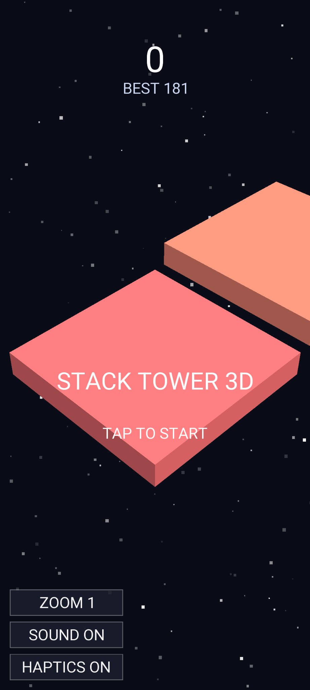
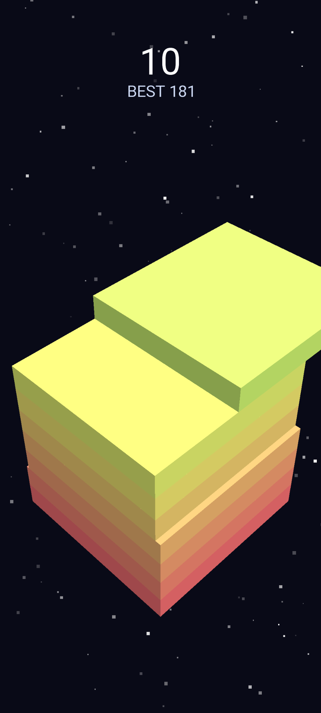
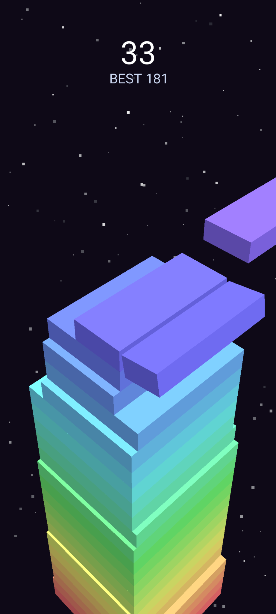
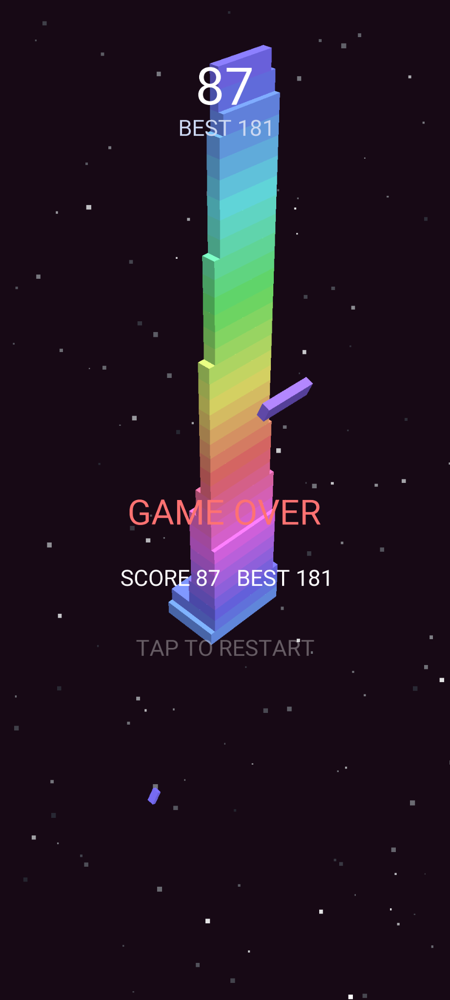

# Stack Tower 3D

There are slides and you click to stack the slides and try to stack them perfectly. Bright colors.

Latest APK: [GitHub releases](https://github.com/Eve-146T/3DStackTower/releases/latest).

## Screenshots

  
  
  
  

## Gameplay

- A block slides back and forth above the tower; **tap to drop it.**
- Whatever hangs over the edge is sliced off and *tumbles* away. Whatever remains is all the next block has to land on.
- Miss the tower entirely and the run is **over**.
- **Frame perfect**: land within one frame of travel of dead centre and the
  block keeps its full size — and the placement scores **double**.
- The slide speed ramps up as the tower grows, and consecutive frame perfects
  raise the chime pitch. 

## License

Stack Tower 3D is free software, licensed under the
[GNU General Public License v3.0](LICENSE). Built with [libGDX](https://libgdx.com/).
